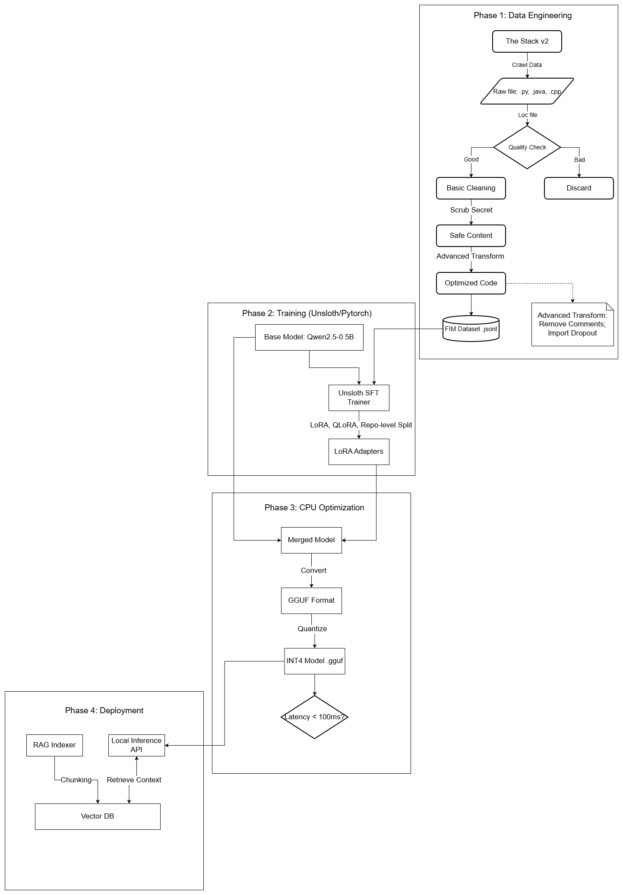

# Project Report

**Project Name**: AI Auto-Complete
**Author**: Mac Pham Thien Long

---

## 1. Executive Summary

This project implements an end-to-end edge computing system for code completion. The solution addresses the latency, privacy, and cost constraints of cloud-based services by running locally on standard hardware.

**Key Achievements:**
-   **Inference Latency**: 20-50ms on CPU.
-   **Model Efficiency**: ~400MB model size using Q4_K_M quantization.
-   **Architecture**: Full pipeline from data engineering to deployment using QLoRA fine-tuning and DPO alignment.
-   **Independence**: Zero cloud dependency and no external API keys required.

---

## 2. Problem Statement

### 2.1. Context

Modern development workflows increasingly rely on intelligent code completion. However, existing solutions often rely on cloud APIs, which present several challenges:

-   **Latency**: Cloud round-trips can introduce delays (200-500ms), disrupting the user's typing flow.
-   **Privacy**: Sending proprietary or sensitive code to external servers is often restricted in enterprise environments.
-   **Cost**: Cloud services typically incur recurring subscription fees.
-   **Hardware**: Local alternatives often require high-end GPUs with significant VRAM, which are not standard in all development machines.

### 2.2. Objectives

1.  **Data Pipeline**: Establish a robust pipeline for cleaning and preparing code data for "Fill-in-the-Middle" (FIM) training.
2.  **Model Training**: Fine-tune a lightweight model (Qwen2.5-Coder) using efficient techniques (QLoRA) and alignment strategies (DPO).
3.  **Optimization**: Quantize the model to run efficiently on CPUs without significant accuracy loss.
4.  **Deployment**: Create a production-ready, OpenAI-compatible API server for easy integration with existing tools.

---

## 3. Solution & Architecture

### 3.1. System Overview

The system consists of four distinct phases:

1.  **Phase 1: Data Engineering**
    -   Collection of raw code from "The Stack" dataset.
    -   Scrubbing of sensitive information (secrets, PII).
    -   Transformation into FIM format for training context awareness.

2.  **Phase 2: Model Training**
    -   **Base Model**: Qwen2.5-Coder-0.5B-Instruct.
    -   **SFT (Supervised Fine-Tuning)**: Using QLoRA for parameter efficiency.
    -   **DPO (Direct Preference Optimization)**: Aligning the model to prefer correct code completions.

3.  **Phase 3: Optimization**
    -   Merging LoRA adapters into the base model.
    -   Conversion to GGUF format.
    -   Quantization to 4-bit (Q4_K_M) for reduced memory footprint.

4.  **Phase 4: Deployment**
    -   FastAPI server using `llama-cpp-python` bindings.
    -   Implementation of efficient token healing and stop criteria.
    -   Integration with VS Code via the Continue extension.
The following diagram illustrates the complete workflow, from data processing to ensuring the model runs efficiently on consumer hardware.

  

### 3.2. Technology Stack

-   **Model**: Qwen2.5-Coder-0.5B-Instruct (Selected for its high performance-to-size ratio).
-   **Training**: Unsloth, QLoRA, DPO.
-   **Inference**: llama.cpp, GGUF.
-   **Backend**: Python, FastAPI, Uvicorn.
-   **Infrastructure**: Docker.

### 3.3. Core Algorithms

**Fill-in-the-Middle (FIM)**:
Unlike standard left-to-right generation, FIM allows the model to consider both the preceding code (prefix) and the following code (suffix) to generate the missing middle section. This is crucial for inline code completion.

**Quantization**:
We utilize the Q4_K_M quantization method, which reduces the precision of model weights to 4 bits. This drastically reduces memory usage (from ~1GB to ~400MB) and improves inference speed on CPUs, with negligible impact on generation quality.

---

## 4. Implementation Details

### 4.1. Data Pipeline
Scripts in `phase1_data_engineering` handle the downloading, filtering, and sanitization of code. Regular expressions are used to identify and redact secrets (API keys, IP addresses).

### 4.2. Model Development
Training performs SFT followed by DPO. DPO is chosen over RLHF (Reinforcement Learning from Human Feedback) for its stability and data efficiency, as it does not require a separate reward model.

### 4.3. Application Server
The deployment server (`phase4_deployment/server_gguf.py`) implements:
-   **Dynamic Stop Tokens**: Adjusts stopping criteria based on the detected language (Python, C++, Java) and completion mode (Inline vs. Block).
-   **Token Healing**: fixs tokenization artifacts that occur at the boundaries of the prompt and completion.
-   **Metrics Calculation**: Real-time evaluation of completion quality using edit similarity.

---

## 5. Results

### 5.1. Performance
-   **Throughput**: 15-30 tokens/second on CPU (4 threads).
-   **Edit Similarity**: ~75-85%.
-   **Exact Match Rate**: ~40-50%.

### 5.2. Business Value
This solution offers a cost-effective, private alternative to commercial code assistants. It empowers developers to use AI tools in restricted environments (e.g., air-gapped networks) without additional hardware investment.

---

## 6. Future Work

-   **RAG Integration**: Implementing Retrieval-Augmented Generation to inject project-specific context.
-   **Streaming Support**: Enhancing the client-side experience with token-by-token streaming.
-   **Language Expansion**: Explicit training for additional languages like Rust and TypeScript.
-   **Telemetry**: Collecting anonymous usage data to further refine the model.

